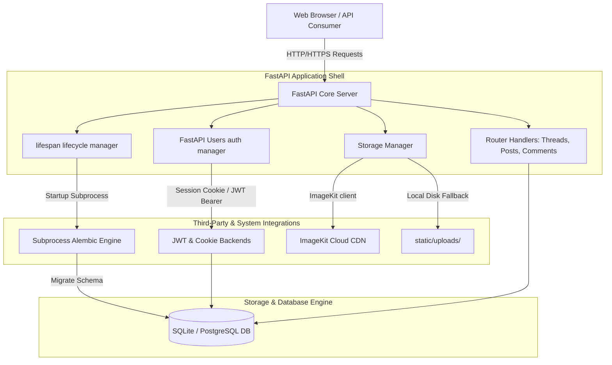

# 🏛️ Forumline FastAPI Web Service

[](https://www.python.org/)
[](https://fastapi.tiangolo.com/)
[](https://www.sqlalchemy.org/)
[](https://alembic.sqlalchemy.org/)
[](tests/)
[](LICENSE)

**Forumline** is a production-ready FastAPI web service with a discussion forum, media feed, and a lightweight SPA-style navigation layer. It is built to run cleanly in local dev (SQLite + local uploads) and in cloud deployments (Render + PostgreSQL + ImageKit CDN fallback).

---

## 🗺️ Table of Contents
- [🏛️ Forumline FastAPI Web Service](#️-forumline-fastapi-web-service)
  - [🗺️ Table of Contents](#️-table-of-contents)
  - [🏗️ System Architecture](#️-system-architecture)
  - [🛡️ Key Architectural Design Patterns](#️-key-architectural-design-patterns)
    - [1. Programmatic Subprocess Migrations](#1-programmatic-subprocess-migrations)
    - [2. Dual-Layer Resilient Upload Pipeline](#2-dual-layer-resilient-upload-pipeline)
    - [3. High-Performance Vanilla JS SPA Router](#3-high-performance-vanilla-js-spa-router)
    - [4. Dual-Transport Authentication (Session Cookie + JWT)](#4-dual-transport-authentication-session-cookie--jwt)
  - [📂 Directory \& Code Symbol Index](#-directory--code-symbol-index)
  - [⚙️ Environment Configuration (`.env`)](#️-environment-configuration-env)
  - [🚀 Quick Start: Local Installation](#-quick-start-local-installation)
    - [Prerequisites](#prerequisites)
    - [Setup Steps](#setup-steps)
  - [💾 Database Migrations (Alembic Operations)](#-database-migrations-alembic-operations)
    - [Developer Warning: Autogenerated Migration UUID Imports](#developer-warning-autogenerated-migration-uuid-imports)
  - [🧪 Test Suite Execution](#-test-suite-execution)
  - [📡 Production API Endpoint Reference](#-production-api-endpoint-reference)
    - [1. Authentication & Session Handlers](#1-authentication--session-handlers)
    - [2. Forums, Categories \& Discussion Threads](#2-forums-categories--discussion-threads)
    - [3. Media Upload Feed](#3-media-upload-feed)
  - [🚦 Search, Filters & Pagination](#-search-filters--pagination)
  - [📤 Upload Limits & Validation](#-upload-limits--validation)
  - [☁️ Production Deployment Checklist (Render & Cloud PostgreSQL)](#️-production-deployment-checklist-render--cloud-postgresql)

---

## 🏗️ System Architecture

The following diagram illustrates the routing layout, core FastAPI handlers, service integrations, and physical persistence layers:



---

## 🛡️ Key Architectural Design Patterns

### 1. Programmatic Subprocess Migrations
To ensure seamless deployment and zero-touch setup, the application triggers migrations inside the FastAPI lifespan hooks. Programmatic migrations run via `sys.executable -m alembic upgrade head` in a separate process rather than the current process. This prevents event loop conflicts and blocks common in async database environments, ensuring the schema is successfully applied before web worker nodes start accepting client traffic.

### 2. Dual-Layer Resilient Upload Pipeline
The media storage engine has a built-in fallback design to guarantee service availability:
* **Cloud Delivery**: If `IMAGEKIT_PRIVATE_KEY` is provided, uploads are automatically sent to the **ImageKit CDN** for optimal global caching and resizing.
* **Local Fallback**: If cloud keys are missing or the CDN is unreachable, the system automatically redirects file streams to [static/uploads/](file:///d:/_Coding_Tutorials_Only_Important_Ones/Fast-API-Tutorial/static/uploads/) on local storage without interrupting the user experience.

### 3. High-Performance Vanilla JS SPA Router
The user interface features a custom, lightweight Client-Side Single Page Application (SPA) engine. It:
* Intercepts standard browser anchor clicks and form submissions in the frontend templates.
* Issues async fetch requests with headers `Accept: text/html` and `X-Requested-With: spa`.
* Parses partial HTML response blocks from the backend using the browser's native `DOMParser`.
* Performs target DOM swapping inside the layout's main container.
* Eliminates the overhead of heavy frontend frameworks (React/Vue) while keeping fast page transitions.

### 4. Dual-Transport Authentication (Session Cookie + JWT)
The identity layer uses **FastAPI Users** to provide two parallel authentication strategies:
1. **Cookie Transport Backend**: Built for web browsers, storing session info in HttpOnly, SameSite cookies.
2. **JWT Bearer Transport Backend**: Designed for programatic API clients, verifying standard authorization headers.

---

## 📂 Directory & Code Symbol Index

* main.py - Main entrypoint to load `.env` variables and start the Uvicorn server.
* app/app.py - Application initialization, lifespan hooks, routes, and core handlers.
* app/auth.py - User management, JWT strategies, and cookie transport configuration.
* app/db.py - SQLAlchemy async engine and model definitions.
* app/images.py - ImageKit CDN client initialization.
* app/schemas.py - Pydantic schemas for request/response payloads.
* templates/ - Jinja templates for forum, feed, and auth pages.
* static/ - CSS, logos, and local upload storage (for dev only).

---

## ⚙️ Environment Configuration (`.env`)

Create a `.env` configuration file in the root directory. Below is the configuration setup for both development and production environments:

| Environment Variable | Local Dev Default | Production Environment (Render) | Description |
| :--- | :--- | :--- | :--- |
| `DATABASE_URL` | `sqlite+aiosqlite:///./forum.db` | `postgresql+asyncpg://...` | Connection URI. Must use async drivers (`aiosqlite` or `asyncpg`). |
| `JWT_SECRET` | `development-secret-key-32-bytes` | `high-entropy-secure-random-key` | Encryption secret for signature verification. |
| `JWT_LIFETIME_SECONDS` | `3600` | `3600` | Expiration lifetime duration for JWT tokens and cookies (in seconds). |
| `APP_ENV` | `development` | `production` | Sets environments. Setting `production` enforces `Secure=True` cookies. |
| `HOST` | `127.0.0.1` | `0.0.0.0` | IP interface where the web application bind socket is listening. |
| `PORT` | `8000` | `8000` | Port allocation for incoming network traffic. |
| `RELOAD` | `true` | `false` | Enables/disables live code reloading on files modification. |
| `IMAGEKIT_PRIVATE_KEY` | *(Optional)* | `private_...` | API key for ImageKit CDN. If missing, uploads fallback to local storage. |
| `MAX_UPLOAD_BYTES` | `20971520` | `20971520` | Max upload size in bytes (default 20MB). |

---

## 🚀 Quick Start: Local Installation

### Prerequisites
* **Python**: `3.10` or higher
* **Package Engine**: [uv](https://github.com/astral-sh/uv) (fast Python package installer and resolver)

### Setup Steps

1. **Clone the Repository**
   ```bash
   git clone <repository-url>
   cd Fast-API-Tutorial
   ```

2. **Configure Local Environment**
   Create a `.env` file in the root folder:
   ```env
   DATABASE_URL=sqlite+aiosqlite:///./forum.db
   JWT_SECRET=super-secret-development-key-change-me
   JWT_LIFETIME_SECONDS=3600
   APP_ENV=development
   HOST=127.0.0.1
   PORT=8000
   RELOAD=true
   ```

3. **Install Dependencies**
   Use `uv` to sync libraries and setup the virtual environment:
  ```bash
  uv sync --all-extras
  ```

4. **Start the Application**
   Run the application web server locally:
   ```bash
   uv run python main.py
   ```
   * The web service will launch at `http://127.0.0.1:8000`
   * View the Swagger API Docs interface at `http://127.0.0.1:8000/docs`

---

## 💾 Database Migrations (Alembic Operations)

Alembic handles database structure, schema modifications, and migration histories.

* **Generate a new Migration Script**:
  After updating tables or models in [db.py](file:///d:/_Coding_Tutorials_Only_Important_Ones/Fast-API-Tutorial/app/db.py), generate a new revision:
  ```bash
  uv run alembic revision --autogenerate -m "describe_your_changes_here"
  ```
* **Manually run upgrades**:
  ```bash
  uv run alembic upgrade head
  ```
* **If your DB already has tables and you want to align Alembic without recreating them**:
  ```bash
  uv run alembic stamp head
  ```
* **Revert the last schema change**:
  ```bash
  uv run alembic downgrade -1
  ```

> [!WARNING]
> ### Developer Warning: Autogenerated Migration UUID Imports
> Alembic's autogeneration tool does not automatically import custom type namespaces for generated models. Since this project uses custom `GUID` types from the `fastapi_users_db_sqlalchemy` package, autogenerated files will throw a `NameError: name 'fastapi_users_db_sqlalchemy' is not defined`.
> 
> **To fix this:** open the newly generated migration file in `alembic/versions/` and add the following import statement at the top:
> ```python
> import fastapi_users_db_sqlalchemy
> ```

---

## 🧪 Test Suite Execution

Automated E2E integration test runs evaluate user registries, authentication flows, JWT token validations, database cascade deletes, comments, and media post uploads.

Execute the test suite using `uv`:
```bash
uv run pytest
```
* **Database isolation**: The tests run on an isolated SQLite database at `sqlite+aiosqlite:///./test_test.db` which is created and cleaned up automatically.
* **Warning clean**: All tests are fully optimized with zero warning logs.

---

## 📡 Production API Endpoint Reference

### 1. Authentication & Session Handlers

| Method | Endpoint | Description | Request Structure / Headers |
| :---: | :--- | :--- | :--- |
| `POST` | `/auth/register` | Register a new user | Form-Data: `email`, `password` |
| `POST` | `/auth/jwt/login` | Authenticate using JWT (returns token string) | Form-Data: `username`, `password` |
| `POST` | `/auth/cookie/login` | Authenticate using cookies (registers session) | Form-Data: `username`, `password` |
| `GET` | `/logout` | Terminate active user sessions & clear cookies | Headers: Cookie auth parameters |

### 2. Forums, Categories & Discussion Threads

| Method | Endpoint | Description | Request Structure / Headers |
| :---: | :--- | :--- | :--- |
| `GET` | `/` | Main discussion board page (returns thread cards) | HTML Page Response |
| `GET` | `/categories/new` | Create category form | HTML Page Response |
| `POST` | `/categories/new` | Create a new category | Form-Data: `name`, `description` |
| `POST` | `/new` | Publish a new discussion thread | Form-Data: `title`, `body`, `category_id` |
| `POST` | `/t/{thread_id}/comment` | Add a comment response | Form-Data: `body` |

### 3. Media Upload Feed

| Method | Endpoint | Description | Request Structure / Headers |
| :---: | :--- | :--- | :--- |
| `GET` | `/posts` | Media feed page | HTML Page Response |
| `GET` | `/feed` | Get media posts (JSON API format) | Returns list of `PostRead` values |
| `POST` | `/upload` | Upload media post | Multipart Form-Data: `file`, `caption`, `content` |
---

## 🚦 Search, Filters & Pagination

The forum supports search and category filtering on the home page:

* Search query: `/?q=fastapi`
* Category filter: `/?category=<uuid>`
* Pagination: `/?limit=10&offset=0`

The media feed supports pagination via:

* `/posts?limit=24&offset=0`

Limits are clamped for safety: forum pages max 25, feed pages max 50.

---

## 📤 Upload Limits & Validation

Uploads are validated on both client and server:

* Max size: `MAX_UPLOAD_BYTES` (default 20MB)
* Allowed types: images and videos only
* Client UI shows upload progress and validates before upload

If `IMAGEKIT_PRIVATE_KEY` is not set, uploads fall back to local storage under `static/uploads/` (not persistent on Render).
| `PATCH` | `/posts/{post_id}` | Edit an upload post | Form-Data: `caption` *(optional)*, `content` *(optional)* |
| `DELETE` | `/posts/{post_id}` | Delete a media post and assets | Authentication header checks apply |

---

## ☁️ Production Deployment Checklist (Render & Cloud PostgreSQL)

Follow these steps to deploy this application to Render:

1. **Provision Managed Databases**:
   Create a Render PostgreSQL instance. Set the database connection parameter in the environment. Make sure it uses the `postgresql+asyncpg://` schema prefix so SQLAlchemy uses the correct asynchronous driver.

2. **Configure Environment Variables in Render**:
   * Set `APP_ENV` to `production` (This turns off reload, enables secure HTTPS cookie configurations, and scopes error details).
   * Set `JWT_SECRET` to a high-entropy cryptographically secure secret.
   * Provide `IMAGEKIT_PRIVATE_KEY` to enable CDN-based image storage.

3. **Service Build & Launch Commands**:
   * **Build Command**:
     ```bash
     pip install uv && uv sync --frozen --no-dev
     ```
   * **Start Command**:
     ```bash
     uv run python main.py
     ```
     *(The lifespan hook will automatically apply migrations to your Render database on startup before the server starts receiving requests).*
